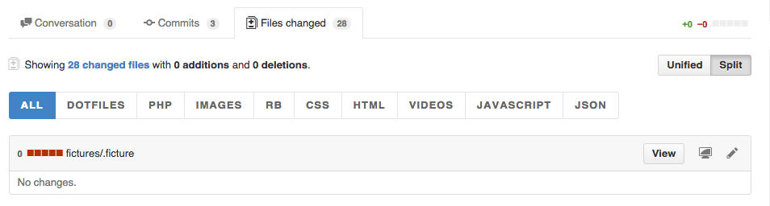

# Github Pr Filter

Add ability to filter files in pull requests

## Install

### Google Chrome
* Install this extension from the [Chrome web store](https://chrome.google.com/webstore/detail/github-pr-filter/fjmalelcdgindphooaabcgmmnmoclpee).

Or download this repository and load it as unpacked extension.

### Opera
* Enable Chrome extensions for Opera [here](https://addons.opera.com/en/extensions/details/download-chrome-extension-9/);
* Then install this extension from the [Chrome web store](https://chrome.google.com/webstore/detail/github-pr-filter/fjmalelcdgindphooaabcgmmnmoclpee).

Or download this repository and load it as unpacked extension.

## Example

## License

MIT © [Daniel Husar](https://github.com/danielhusar)
